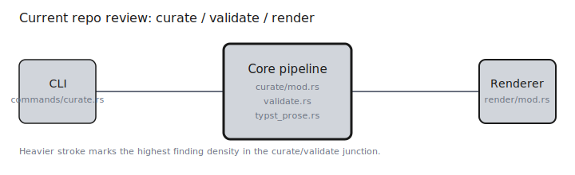

# Current Repo Review



This review focused on the current repository state, with attention on the recently changed `curate -> validate -> render` path. The workspace test suite was green under `cargo nextest run --workspace`, so the findings below are gaps in current assertions rather than failures already caught by the existing suite.

## The Location Truthfulness Surface

The recent validation pass is useful, but the CLI still has a blind spot: it only tells the operator about validation when there is a suggested alias to print. That means a broken location with no heuristic recovery path can pass through curate without any visible warning.

### `curate-validation-suppresses-unresolved-without-suggestion`

> If a file is missing or the term simply is not there, I do not need to fool the validator. I just need it to fail in a way the CLI decides not to mention.

Evidence:

```rust
crates/colophon/src/commands/curate.rs
let report =
    colophon_core::validate::validate_locations(terms, &terms.source_dir, source_extensions);
if !report.suggestions.is_empty() {
    eprintln!(
        "Validation: {} resolved, {} unresolved",
        report.resolved, report.unresolved
    );
}
```

`validate_locations()` increments `report.unresolved` for missing files and plain misses, but `display_validation()` only emits output when the alias heuristic found something to suggest. That suppresses the exact cases the validation pass was meant to surface: locations that are simply wrong. In practice this turns validation into a partial hinting feature instead of a trustworthy post-curate gate.

Remediation should start with always printing a validation summary when unresolved locations exist, followed by file-level details. If this command is expected to run in CI, unresolved locations should also be eligible for a non-zero exit status.

Temporal context: this reporting gate arrived in commit `60bf2994b756b17fa7dbc3d0b970c1e283c4e404` on 2026-03-21 and has not been meaningfully revised since.

### `main-file-detection-uses-substring-match`

The same surface also overstates certainty about which files are substantive discussions. `main_files` is treated as a substring rather than a specific path identity.

```rust
crates/colophon-core/src/curate/mod.rs
let is_main = ct
    .main_files
    .iter()
    .any(|mf| loc.file.contains(mf.as_str()));
```

This is quiet data corruption, not a crash. If Claude marks `auth.md` as substantive, any candidate location whose path merely contains that fragment can also become `main: true`. A corpus with `old-auth.md`, `appendix/auth.md.bak`, or similar overlaps will get bold page numbers in the final index where none were intended.

Exact relative-path comparison is the safe default here. A regression test with overlapping file names would lock it down.

Temporal context: the mapping logic was introduced with the initial curate post-processing and remains live in `HEAD`.

---

## The Text Boundary Surface

The render and Typst prose matchers both implement case-insensitive search by lowercasing whole buffers and then reusing those offsets against the original source. That works for ASCII. It is not a correct model for Unicode text.

### `unicode-casefold-offsets-drift-from-source`

> I do not care whether the search is “case-insensitive” in theory. I care whether the byte offset still points at the same place in the original manuscript after the fold.

Evidence:

```rust
crates/colophon-core/src/render/mod.rs
let lower_text = text.to_lowercase();
let lower_term = term.to_lowercase();
lower_text.find(&lower_term).map(|pos| pos + term.len())
```

```rust
crates/colophon-core/src/typst_prose.rs
let lower_source = source.to_lowercase();
let lower_term = term.to_lowercase();
let abs_pos = start + pos;
let abs_end = abs_pos + lower_term.len();
```

Unicode case folding is not length-preserving. Some characters expand or normalize differently when folded, which means offsets discovered in the lowercased buffer are not guaranteed to map back to the same byte positions in the original source. Once that happens, render can insert markers at the wrong place and the Typst prose validator can misclassify whether a hit is inside a safe prose span.

This is a robustness bug rather than an exploit path, but it matters in exactly the multilingual publishing workflows a glossary/index tool should handle well. The fix is to compare against the original buffer while preserving original spans, not to search a transformed copy and reuse its byte indices.

Temporal context: the render matcher shipped in `8855d1a30c42e7014e187f2579d9ca31a489c4ec`; the same pattern was propagated into the shared Typst prose matcher in `60bf2994b756b17fa7dbc3d0b970c1e283c4e404`.

---

## Remediation Ledger

| Narrative | Slug | Concern | Location | Effort | Chain dependencies |
| --- | --- | --- | --- | --- | --- |
| The Location Truthfulness Surface | [curate-validation-suppresses-unresolved-without-suggestion](#curate-validation-suppresses-unresolved-without-suggestion) | significant | `crates/colophon/src/commands/curate.rs:58` | small | enables `main-file-detection-uses-substring-match` |
| The Location Truthfulness Surface | [main-file-detection-uses-substring-match](#main-file-detection-uses-substring-match) | moderate | `crates/colophon-core/src/curate/mod.rs:348` | trivial | enabled by `curate-validation-suppresses-unresolved-without-suggestion` |
| The Text Boundary Surface | [unicode-casefold-offsets-drift-from-source](#unicode-casefold-offsets-drift-from-source) | moderate | `crates/colophon-core/src/render/mod.rs:106`, `crates/colophon-core/src/typst_prose.rs:101` | medium | none |
